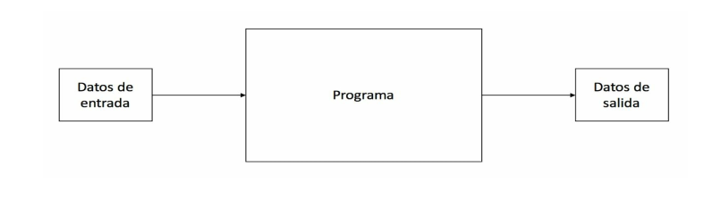

<h2> Fundamentos </h2>

* ¿ Que es un programa?

Un programa es un conjunto de instrucciones o pasos a seguir que se le dan a un ordenador de forma secuencial para que realice una tarea especifica.

EL flujo normal de un programa es el siguiente:

1. El programa recibe datos de entrada, normalmente introducidos por los usuarios de éste.
2. Ejecuta las intrucciones especificas por el programador.
3. El programa obtiene como resultado un conjunto de datos de salida.




<h3> Manejo de mansajes por pantalla </h3>

En python hay dos comandos (funciones implementadas) que permiten la interacion del usuario con el programa estos son  <strong>print y input</strong>

* Print :  el comando print permite mostrar infromacion al usuario esta informacion puede ser cadenas de caracteres, variables o las dos. El comando print tiene los siguientes partametros.
    * end: permite añadir una cadena de text como elemento final del conjunto de cadenas de texto
    * sep: permite añadir una cadena de texto al final de cada cadena enviada para mostrar por pantalla y sustituir el espacio en blanco que se introduce por defecto entre las diferentes cadenas de texto que son enviadas para mostrarse por pantalla.

* Input:  El comando input te va a permitir leer información introducida por los usuarios de la aplicacion mediante el teclado.

<h4>Variables</h4>

Las variables son datois que residen en la memoria del ordenador. Tienen las siguientes caracteristicas:

1. **Nombre:** identificador dentro del codigo fuente.
2. **Tipo:** tipo de dato que almacena la variable.
3. **Valor:**  valor que almacenan. Al declarar una variable tieens que indicarle un valor inicial, que puede verse modificado a medida que se va ejecutando el programa y según vatas necesitando, de ahí que se llamen variables.

```python
edad = 18  # tipo de dato int
nombre = "juanito" # tipo de datos string
altura = 1.75    # tipo de daton float 
```
<h3>Utilizacion de tipos de datos básicos </h3>

<h4>Tipos de datos</h4>

Las variables en Pyrhon puede ser de los siguientes tipos:

|    Tipo de dato     |                                               Descripción                                               |
| ---------------------- | -------------------------------------------------------------------------------------------- |
| Entero                 | Número sin decimales, tanto positivo como negativo,incluyendo el 0.  |
| Real                    | Número con decimales, tanto positivo como negativo,incluyendo el 0. |
| Complejo            | Número con parte imaginaria                                                                 |
| Cadena de texto | Texto.                                                                                                      |
| Booleanos           | Puede tener dos valores: True o False                                                   |
| Conjuntos           | Coleccion de elementos no ordenados y no repetidos                           |
| Listas                  | Vector de elementos que pueden ser de diferentes tipos de datos        |
| Tuplas                 | Lista inmutable de elementos                                                                 |
| Diccionario          | Lista de elementos que contienen claves y valores.                              |

<h4>Operadores</h4>

En python existe una serie de operadores:

* Operadores de asignación.
* Operadores aritméticos.
* Operadores relacionales.
* Operadores lógicos.

<h5> Operador de asignacion </h5>

el operador de asignacion en paitos es  <strong>" = "</strong>  sirve para asignar un valor a una variable, lo que esté en la parte derecha del operador sera asignado (almacenado) en la variable de la izquierda:

```python
precio = 923
apellido = "Moreno"
numero = 34
```
<h5> Operadores aritmetricos </h5>

Los operadores aritméticos son aquellos operadores que nos van a permitir realizar operaciones aritméticas con los datos 

```python
    a = 2
    b = 4
    suma = a + b 
    resta = a - b
    division = a/b
    mutliplicacion = a*b
    potenciacion = a**b
    
```

<h5>Operadores relacionales</h5>

Los operadores relacionales son aquellos que van a permitirte realizar conparacionetes entre dos elementos :

| Operador |      Significado       |
| ------------- | ------------------------ |
| <              | Menor que             |
| >              | Mayor que             |
| <=            | Menor o igual que |
| >=            | Mayor o igual que |
| ==            | Igual que               |
| !=             | Distinto que           |

El resultado de una operacion relacional puede ser unicamente dos valores:

* **True:** La comparacion se cumple.
* **False:** La comparacion no se cumple

```python
    var1  = 7 < 5  # La variable tendre un valor booleano de False.
     var2 = 9==3  # La variable tendra un valor booleano de False.
     var3 = 2 < 12 # La variable tendra un valor booleano de True.
     var4 = 88>=4  # La variable tendra un valor booleano de True.
```

<h5> Operadores lógicos </h5>
Los operadores lógicos permiten combinar las operaciones relacionales del punto anterior o valores booleanos independientes para obtener un único resultado. 

1.  **AND:** Operador lógico que realiza la operacion lógica en la cual mientra los dos elementos sean True devuelve True en caso contrario devuelve False.
2.  **OR:** Operador lógico que realiza la operacion lógica en la cual mientras un elementos sea True devuelve True en caso contrario devuelve False.
3.  **NOT:** Operador lógico que realiza la operacion lógica la cual niega el valor si el valor era True devuelve False en caso contrario devueve True.

```python
var1 = (5<3) AND (4==7) # Almacena el valor de False.
var2 = (1<7) OR (3==3) # Almacena el valor de True.
var3 = NOT(6==7) # Almacena el valor de True.
var4 =True AND False # Almacena el valor de False.
```

<h3>Estrucutras de control</h3>

<h4>Condicionales</h4>

son las estrucuturas en las cuales el codigo se ejecuta dependiendo de una condicion si la condicion es True  se ejecuta si no se pasa a la siguente condicion, si ninguna de las condiciones es True entonces se ejecuta el condigo de una del else.

```python
    
    edad = 18
    if(edad >= 0 ): 
        if(edad >= 18 ):
            print("Es mayor de edad")
        else:
        print("Es menor de edad")    
    else:
        print("Edad mal digitada")
```

<h4>Bucles condicionales</h4>

El bucle <strong>While</strong> es el cual se ejecuta el codigo hasta que se cumpla cierta condicion.

```python
    num = None
    while(num != 0):
        num = int(input("Introdusca un numero: "))
        
```
<h4>Bucles iterativos</h4>

El bucle for ejecuta el bloque de codigo la canditdad de veces definida por la secuencia iterativa.

```python
    palabra = "The world is connect"
    for letra in range(palabra):
    print(letra)
```

<h3>Tipos de datos estructurados</h3>

<h4>Listas</h4>

Una **Lista** es una secuencias ordenadas de objetos de distintos tipos.

Se construyen poniendo los elementos entre corchetes ``[  ]`` separados por comas.
Se caracterizan por:

* Tienen orden
* Pueden contener elementos de distintos tipos.
* Son mutables, es decir, pueden alterarse durante la ejecución de una programa.

```python
    type([ ])
    [1, ''dos", True ] # Listas con elementos de distintos tipos.
    [ 1, [2,3] ,4 ] #  Listas anidadas.
```

<h5>Creacion de listas mediante la  funcion list</h5>

Otro forma de crear listas es mediante la funcion  `` list()`` 

* ``list(c)`` : Crea una lista con los elementos de la secuencia o colección c.

Se pueden indicar los elementos separados por comas, mediante una cadena, o mediante una colección de elementos iterable.

```python
    list()
    list(1,2,3)
    list("Python")
``` 

<h5>Acceso a los elementos de una lista</h5>

Se utiliza los mismos operadores de acceso que para cadenas de caracteres.

* `l[i]` : Devuelve el elemento de la lista *l* con el índice *i*

```python
a = [ 'P', 'y','t','h','o','n']
a[0]
a[5]
a[6]
```

<h5>Sublistas</h5>

* `l[ i : j : k ]`: Devuelve la sublista desde el elemento de *l* con el índice *i* hasta el elemento anterior al índice *j*, tomando elementos cada *k*.

```python
a = [ 'P', 'y','t','h','o','n']
a[1:4]
a[1:1]
a[:-3]
a[:]
a[0:6:2]
```

<h5>Operaciones que no modifican una lista</h5>

* `len(l)` : Devuelve el número de elementos de la lista *l*.
*  `min(l)`: Devuelve el mínimo elemento de la lista *l* siempre que los datos sean comparables.
*  `max(l)` : Devuelve el máximo elemento de la lista *l* siempre que los datos sean comparables.
*  `sum(l)` : Devuelve la suma de los elementos de la lista *l* , siempre que los datos se puedan sumar.
* `dato in l` : Devuelve `True` si el dato `dato` pertenece a la lista *l* y `False` en caso contrario.
* `l.index(dato)` : Devuelve la posición que ocupa en la lista *l* el primer elemento con valor `dato`.
* `l.count(dato)` : Devuelve el número de veces que el valor `dato` está contenido en la lista *l*.
* `all(l)` : Devuelve `True` si todos los elementos de la lista *l* son `True` y `False` en caso contrario.
* `any(l)` : Devuelve `True` si algún elemento de la lista *l* es `True` y `False` en caso contrario.

```python
    a = [1,2,2,3]
    len(a)
    min(a)
    max(a)
    sum(a)
    3 in a  # True
```

<h5>Operaciones que modifican una lista</h5>

* `l1 + l2` : Crea una nueva lista concatenan los elementos de la listas `l1` y `l2`.
* `l.append(dato)` : Añade dato al final de la lista *`l`*.
* `l.extend(sequencia)` : Añade los datos de sequencia al final de la lista *`l`*.
* `l.insert(índice, dato)` : Inserta dato en la posición índice de la lista *`l`* y desplaza los elementos una posición a partir de la posición índice.
* `l.remove(dato)` : Elimina el primer elemento con valor dato en la lista *`l`* y desplaza los que están por detrás de él una posición hacia delante.
* `l.pop([índice])` : Devuelve el dato en la posición índice y lo elimina de la lista *`l`*, desplazando los elementos por detrás de él una posición hacia delante.
*  `l.sort()` : Ordena los elementos de la lista *`l`* de acuerdo al orden predefinido, siempre que los elementos sean comparables.
* `l.reverse()` : invierte el orden de los elementos de la lista *`l`*.

```python
>>> a = [1, 3]
>>> b = [2 , 4, 6]
>>> a.append(5)
>>> a
[1, 3, 5]
>>> a.remove(3)
>>> a
[1, 5]
>>> a.insert(1, 3)
>>> a
[1, 3, 5]
>>> b.pop()
6
>>> c = a + b
>>> c
[1, 3, 5, 2, 4]
>>> c.sort()
>>> c
[1, 2, 3, 4, 5]
>>> c.reverse()
>>> c
[5, 4, 3, 2, 1]
```

<h5>Copia de listas</h5>

Existen dos formas de copiar listas:

* **Copia por referencia** `l1 = l2:` Asocia la la variable *`l1`* la misma lista que tiene asociada la variable l2, es decir, ambas variables apuntan a la misma dirección de memoria. Cualquier cambio que hagamos a través de *`l1`* o *`l2`* afectará a la misma lista.
* **Copia por valor** `l1 = list(l2):` Crea una copia de la lista asociada a *`l2`* en una dirección de memoria
diferente y se la asocia a *`l1`*. Las variables apuntan a direcciones de memoria diferentes que contienen los mismos datos. Cualquier cambio que hagamos a través de *`l1`* no afectará a la lista de *`l2`* y viceversa.

```python
>>> a = [1, 2, 3]
>>> # copia por referencia
>>> b = a
>>> b
[1, 2, 3]
>>> b.remove(2)
>>> b
[1, 3]
>>> a
[1, 3]

>>> a = [1, 2, 3]
>>> # copia por referencia
>>> b = list(a)
>>> b
[1, 2, 3]
>>> b.remove(2)
>>> b
[1, 3]
>>> a
[1, 2, 3]
```

<h4>Tuplas</h4>

Una **tupla** es una secuencias ordenadas de objetos de distintos tipos.
Se construyen poniendo los elementos entre corchetes `( )` separados por comas.
Se caracterizan por:

* Tienen orden.
* Pueden contener elementos de distintos tipos.
* Son inmutables, es decir, no pueden alterarse durante la ejecución de un programa.

Se usan habitualmente para representar colecciones de datos una determinada estructura semántica, como por ejemplo un vector o una matriz.

```python
# Tupla vacía
type(())
<class 'tuple'>
# Tupla con elementos de distintos tipos
(1, "dos", True)
# Vector
(1, 2, 3)
# Matriz
((1, 2, 3), (4, 5, 6))
```
<h5>Creación de tuplas mediante la función tuple()</h5>

Otra forma de crear tuplas es mediante la función tuple().

* `tuple(c)` : Crea una tupla con los elementos de la secuencia o colección `c`.

Se pueden indicar los elementos separados por comas, mediante una cadena, o mediante una colección de
elementos iterable.

```python
>>> tuple()
()
>>> tuple(1, 2, 3)
(1, 2, 3)
>>> tuple("Python")
('P', 'y', 't', 'h', 'o', 'n')
>>> tuple([1, 2, 3])
(1, 2, 3)
```
<h5>Operaciones con tuplas</h5>

El acceso a los elementos de una tupla se realiza del mismo modo que en las listas. También se pueden obtener subtuplas de la misma manera que las sublistas.
Las operaciones de listas que no modifican la lista también son aplicables a las tuplas.

```python
>>> a = (1, 2, 3)
>>> a[1]
2
>>> len(a)
3
>>> a.index(3)
2
>>> 0 in a
False
>>> b = ((1, 2, 3), (4, 5, 6))
>>> b[1]
(4, 5, 6)
>>> b[1][2]
6
```

<h4>Diccionarios</h4>

Un diccionario es una colección de pares formados por una clave y un valor asociado a la clave.
Se construyen poniendo los pares entre llaves `{ }` separados por comas, y separando la clave del valor con dos puntos `:`. Se caracterizan por:

* No tienen orden.
* Pueden contener elementos de distintos tipos.
* Son mutables, es decir, pueden alterarse durante la ejecución de un programa.
* Las claves son únicas, es decir, no pueden repetirse en un mismo diccionario, y pueden ser de cualquier tipo de datos inmutable.


```python
# Diccionario vacío
type({})
<class 'dict'>
# Diccionario con elementos de distintos tipos
{'nombre':'Alfredo', 'despacho': 218, 'email':'asalber@ceu.es'}
# Diccionarios anidados
{'nombre_completo':{'nombre': 'Alfredo', 'Apellidos': 'Sánchez Alberca'
}}
```

<h5>Acceso a los elementos de un diccionario</h5>

* `d[clave]` devuelve el valor del diccionario `d` asociado a la clave clave. Si en el diccionario no existe esa clave devuelve un error.

* `d.get(clave, valor)` devuelve el valor del diccionario `d` asociado a la clave clave. Si en el diccionario no existe esa clave devuelve valor, y si no se especifica un valor por defecto devuelve `None`.

```python
>>> a = {'nombre':'Alfredo', 'despacho': 218, 'email':'asalber@ceu.es'}
>>> a['nombre']
'Alfredo'
>>> a['despacho'] = 210
>>> a
{'nombre':'Alfredo', 'despacho': 218, 'email':'asalber@ceu.es'}
>>> a.get('email')
'asalber@ceu.es'
>>> a.get('universidad', 'CEU')
'CEU
```

<h5>Operaciones que no modifican un diccionario</h5>

* `len(d)` : Devuelve el número de elementos del diccionario `d`.
* `min(d)` : Devuelve la mínima clave del diccionario `d` siempre que las claves sean comparables.
* `max(d)` : Devuelve la máxima clave del diccionario `d` siempre que las claves sean comparables.
* `sum(d)` : Devuelve la suma de las claves del diccionario `d`, siempre que las claves se puedan sumar.
* `clave in d` : Devuelve  `True` si la clave clave pertenece al diccionario `d` y `False` en caso contrario.
* `d.keys()` : Devuelve un iterador sobre las claves de un diccionario.
* `d.values()` : Devuelve un iterador sobre los valores de un diccionario.
* `d.items()` : Devuelve un iterador sobre los pares clave‑valor de un diccionario.


```python
>>> a = {'nombre':'Alfredo', 'despacho': 218, 'email':'asalber@ceu.es'}
>>> len(a)
3
>>> min(a)
'despacho'
>>> 'email' in a
True
>>> a.keys()
dict_keys(['nombre', 'despacho', 'email'])
>>> a.values()
dict_values(['Alfredo', 218, 'asalber@ceu.es'])
>>> a.items()
dict_items([('nombre', 'Alfredo'), ('despacho', 218), ('email', '
asalber@ceu.es')])
```

<h5>Operaciones que modifican un diccionario</h5>

* `d[clave] = valor` : Añade al diccionario d el par formado por la clave clave y el valor valor.
* `d.update(d2)`. Añade los pares del diccionario `d2` al diccionario `d`.
* `d.pop(clave, alternativo)` : Devuelve del valor asociado a la clave clave del diccionario `d` y
lo elimina del diccionario. Si la clave no está devuelve el valor alternativo.
* `d.popitem()` : Devuelve la tupla formada por la clave y el valor del último par añadido al diccionario `d` y lo elimina del diccionario.
* `del d[clave]` : Elimina del diccionario `d` el par con la clave clave.
* `d.clear()` : Elimina todos los pares del diccionario `d` de manera que se queda vacío.

```python
>>> a = {'nombre':'Alfredo', 'despacho': 218, 'email':'asalber@ceu.es'}
>>> a['universidad'] = 'CEU'
>>> a
{'nombre': 'Alfredo', 'despacho': 218, 'email': 'asalber@ceu.es', '
universidad': 'CEU'}
>>> a.pop('despacho')
218
>>> a
{'nombre': 'Alfredo', 'email': 'asalber@ceu.es', 'universidad': 'CEU'}
>>> a.popitem()
('universidad', 'CEU')
>>> a
{'nombre': 'Alfredo', 'email': 'asalber@ceu.es'}
>>> del a['email']
>>> a
{'nombre': 'Alfredo'}
>>> a.clear()
>>> a
{}
```

<h5>Copia de diccionarios</h5>

Existen dos formas de copiar diccionarios:

* **Copia por referencia** `d1 = d2`: Asocia la la variable `d1` el mismo diccionario que tiene asociado la variable `d2`, es decir, ambas variables apuntan a la misma dirección de memoria. Cualquier cambio que hagamos a través de `l1` o `l2` afectará al mismo diccionario.

* **Copia por valor** `d1 = dict(d2)`: Crea una copia del diccionario asociado a `d2` en una dirección de memoria diferente y se la asocia a `d1`. Las variables apuntan a direcciones de memoria diferentes que contienen los mismos datos. Cualquier cambio que hagamos a través de `d1` no afectará al diccionario de `d2` y viceversa.


```python
>>> a = {1:'A', 2:'B', 3:'C'}
>>> # copia por referencia
>>> b = a
>>> b
{1:'A', 2:'B', 3:'C'}
>>> b.pop(2)
>>> b
{1:'A', 3:'C'}
>>> a
{1:'A', 3:'C'}

>>> a = {1:'A', 2:'B', 3:'C'}
>>> # copia por referencia
>>> b = dict(a)
>>> b
{1:'A', 2:'B', 3:'C'}
>>> b.pop(2)
>>> b
{1:'A', 3:'C'}
>>> a
{1:'A', 2:'B', 3:'C'}
```
